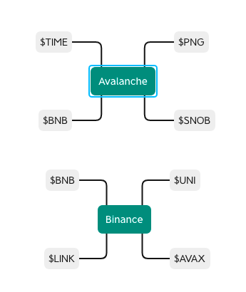
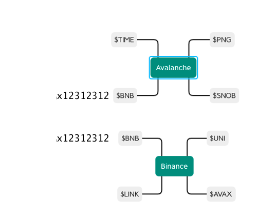

MMM, where should I start

What happened
====================
For those of you who are new to crypto, basically there are different backend networks that different crypto currencies run on.  If you take a look at this diagram

*Different Crypto Networks*

In this case, there are two main networks.  Avalanche and Binance.  On each networks, there are different cryptocurrencies (missing out a bunch of others for simplicity purpose).  

I owned some $TIME (Wonderland) tokens on the Avalanche network and was trying to convert it into $BNB (Binance Coin).

Using an exchange on the Avalanche network like TraderJoe, I converted $TIME into $BNB, I also got my $BNB wallet address provided by Binance.  Here came the problem. 

*Different Crypto Addresses*

Naive as I was, I deposited $BNB from the Avalanche network into an address that exists in Binance but did not exist in the Avalanche network.  Guess what, the money was burned.  It was sent to an empty address.  2,000 dollars down the drain.

I contacted support at Binance at was informed that there was nothing they could do about it since it's not on their network.  Am still awaiting from the Avalanche tech support.  Fingers crossed.

What Could Have Been Done
====================

* Should've send a small amount to test drive

* $BNB should not be tradable on the Avalanche network on TraderJoe.  

* User should not be able to send funds into an empty address (Because of retard like me)

* Currency Conversion into networks should be automatically not a by product

* There is definitely a market for a **bridge + exchange** marketplace to exist rather being separated

## Conclusion ##

It's a crypto wild-west out there.  Make sure you do enough homework before you jump-in.  With large transactions, always do a small amount first.

I view this as a paid education and hope you learnt something from it and please don't make the same mistake.

If you experienced this before and know how to retrieve the funds, please contact me (No scammers, being contacted by a bunch asking to connect the wallet to their DAPPs).

Hope you liked the post, if you have questions or comments shoot me a message at <project.converging.point+finishthem@gmail.com>
 

