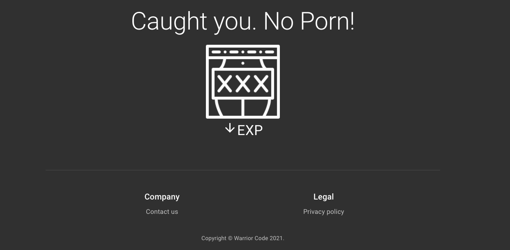
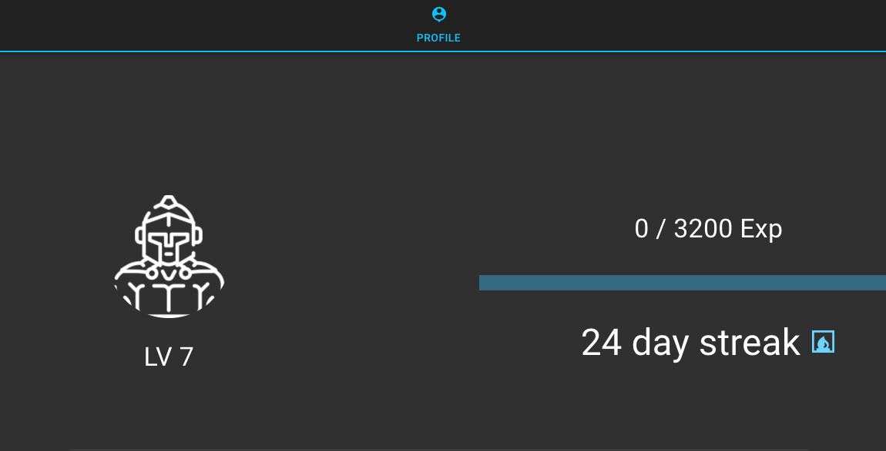
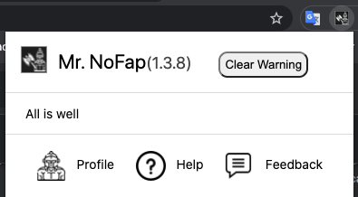
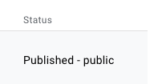

*time: 35 hours*
-------------

Pretty excited on getting my first unfinished project started

The Idea
====================
Porn addiction is a real thing.  It degrades your mind.  It predisposes you to have unrealistic expectation about sex. I have a few friends who were exposed to porn during their teen age years and have been addicted to it.  Porn destroyed their mind.  They found refugee in porn.  I have a personal hatred against porn because porn destroyed my friends lives.    

The initial idea is to build a porn site blocker and also works as an RPG, so the user can level up their profile if they do not visit any porn sites.  Would like to make it as fun as possible rather than just a robotic porn site blocker you know.

The Engineering
====================

There are different browser plugin eco-system to be chosen from.  I picked Chrome because it is the most popular one.  Might expand to other platforms if there is demand.

The plugin was written with **JavaScript, HTML, CSS** all the standard stuff plus some Google Chrome Store best practices that I had to follow.

I came across around **24,389** porn sites or sites that contain sexual explicit content. That's insane.  What's our government doing?  There is no API for retrieving, so I decided to compile the list.  It is open-sourced [here](https://github.com/Gyokuro-cha/landmine).  The nature of the porn sites is that they are constantly changing.

Now to the fun stuff.  Basically, the plugin needs to intercept the porn site after the user types in the porn site URL.  To use an API service can guarantee that the porn site list is constantly being updated, but the issue is the delay.  We don't want the user to even see a flash of the porn site content.  To guarantee a speedy interception is to serve this list locally.

That turned out to be a great choice.  During the actually tests, sites on the list were successfully blocked without flashing the contents.  If the user does visit a porn site, they lose their experience point.

## Experience system ##

*Penalty page*

The user gains certain experience points daily by not visiting a porn site.  This system is based on honor and am pretty sure users sincerely want to stay away from porn.  

*Profile page*

They can level up their avatar.  Each level gets harder.  There is also day counters, so they know their progress.  Streaks are lost if they visit a porn site

*Popup dialogue*

The popup dialogue can be accessed on the top right corner of the browser plugin section.  It displays progress like if the user

* Gain experience
* Level up
* Lose point
* On Streaks
* View Profile page
* Help Page
* Submit Feedback

## Chrome Store Submission ##

After hours of work and testing, its finally time to submit to the Chrome Store.  There is a life time $5 developer program fee up front.

I submitted all the files in a zip file.  Seven days later I got a message saying it was declined because of API violation.

Went back and patched it up, resubmitted, two days later.  It was published onto the Chrome store.

*Extension status*

## Conclusion ##

Very pleased with the result.  There are so many more features I want to add into this plugin, but by adding them, its gonna slow down the release date.

As of now, there has been close to **1,444** users downloaded the plugin.  **10,502** porn sites blocked.

It is not perfect, but over time it gets better.  If you are interested checking out the plugin, it can be downloaded [here](https://chrome.google.com/webstore/detail/mrnofap-block-porn-sites/cpigeaemojebhijbmencldogableknlf).

Hope you liked the post, if you have questions or comments shoot me a message at <project.converging.point+mrnofap@gmail.com>
 

